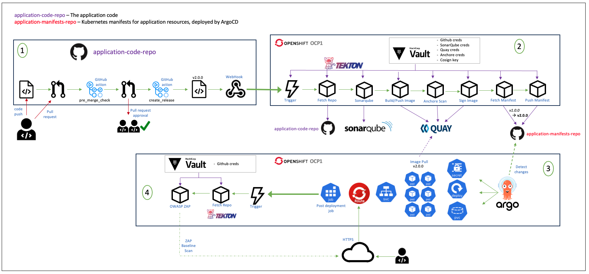

# Software Architecture

These are some handy resources for getting started. This should be enough to get an overview of the most popular tools used by engineers when creating web applications.

## Introductory material

- [Cloud Native, Microservices, Containers, DevOps and Agile](https://www.coursera.org/learn/cloud-native-microservices-containers-devops-agile): This course provides a great basis for understanding the current surrounding technologies, how they all link together and how to decide which to use.

## CNCF

Cloud Native Computing Foundation (CNCF) is a subsidary of the Linux Foundation built to support cloud-native computing. It is a great source of information when mapping out your pipeline. I would recommend reading as much of their website as possible, but here are the highlights of what I found:

- [Landscape](https://landscape.cncf.io/): A compilation of all cloud-native open-source projects - organised and categorised.
- [Trail Map](https://www.cncf.io/blog/2018/03/08/introducing-the-cloud-native-landscape-2-0-interactive-edition/): The Trail Map provides a diagram of the most common path taken in development, with tool recommendations at each step.
- [Guide](https://landscape.cncf.io/guide#introduction): You'll probably notice that there are rather a lot of tools available and a lot of overlap in functionality. This guide helps make the decision of which to use and why.

## D2S

D2S is owned by MOD and is what Catalyze used in the production of the Army Cap Audit Tool. They have a workspace on Atlassian Confluence and Jira with a plethora of documentation which fully encompasses the process of developing a pipeline to SECRET. If possible, read the entire thing - even if not deploying to secret, this resource is super useful for DevOps in general.

Take a look at the [D2S Portal](https://d2s.dev.service.mod.gov.uk/)

**NOTE:** You will require access to D2S for these links to work, otherwise ask Will Sharrock and he will show you these resources.

- [Tools Summary](https://defencedigital.atlassian.net/wiki/spaces/D2SUHub/pages/197591304/D2S+Platform+-+Tools+summary): A basic list of the tools they recommend for each step of the pipeline and why they recommend.
- [Architectural Overview](https://defencedigital.atlassian.net/wiki/spaces/D2SUHub/pages/701890974/1.1+D2S+pipeline+-+Architectural+overview+and+example+pipeline+flow): This describes what the pipeline is and provides a really neat diagram of all the processes involved, and how they all link together.

## Docker and Kubernetes

Most cloud-native applications are deployed using Docker and Kubernetes. Here are some resources for them and their surrounding technologies.

**Docker**

- [Docker Docs](https://docs.docker.com/)
- [Docker Guides](https://docs.docker.com/guides/)
- [Docker Crash Course](https://www.youtube.com/watch?v=pg19Z8LL06w)
- [Docker Compose](https://docs.docker.com/compose/)
- [Writing a Dockerfile](https://docs.docker.com/get-started/docker-concepts/building-images/writing-a-dockerfile/)
- [Creating a Dev Container](https://code.visualstudio.com/docs/devcontainers/create-dev-container)

**Kubernetes**

- [Kubernetes Docs](https://kubernetes.io/docs/home/)
- [Hello Minikube](https://kubernetes.io/docs/tutorials/hello-minikube/)
- [Kubernetes Crash Course](https://www.youtube.com/watch?v=s_o8dwzRlu4)

**Argo CD**

- [Argo CD Docs](https://argo-cd.readthedocs.io/en/stable/)
- [Argo CD Getting Started](https://argo-cd.readthedocs.io/en/stable/getting_started/)
- [Argo CD Crash Course](https://www.youtube.com/watch?v=MeU5_k9ssrs)

**OpenShift**

- [Red Hat Documentation](https://docs.redhat.com/en)
- [IBM Course for Openshift](https://www.coursera.org/learn/ibm-containers-docker-kubernetes-openshift)